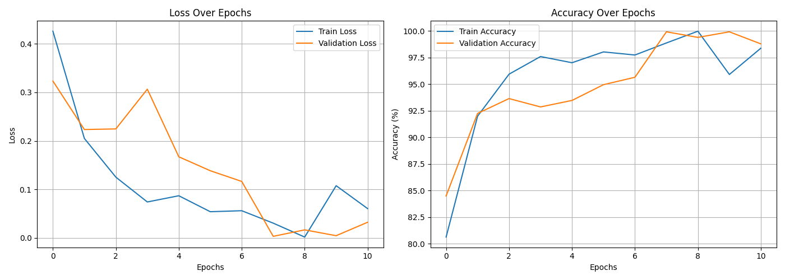
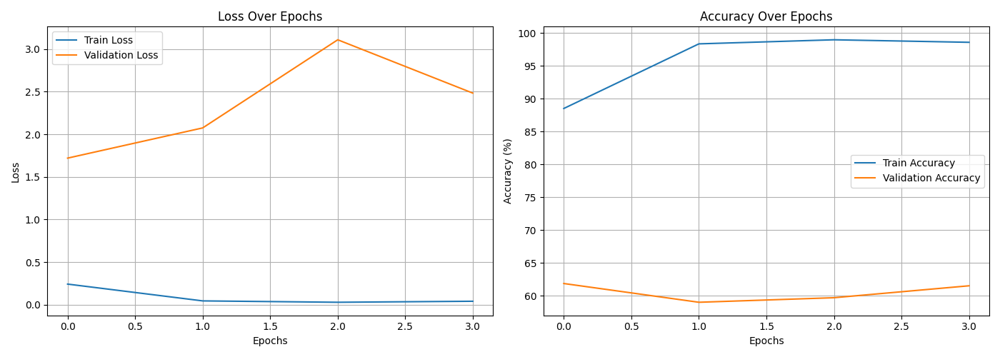
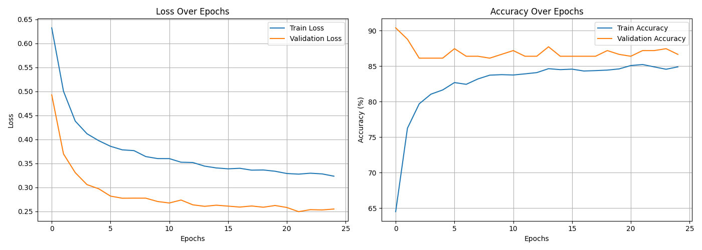

# LoL Match Prediction

This project aims to predict match outcomes in League of Legends using image-based models. The target tournament is the **2024 League of Legends World Championship**. We explore three different approaches:

1. **EfficientNet + Random Shuffle Dataset**: The first approach predicts match outcomes using only images. The base model is **EfficientNet**, trained on a dataset where images are randomly shuffled.
2. **EfficientNet + Split-by-Match Dataset**: The base model remains **EfficientNet**, but instead of random shuffling, the dataset is split by match to prevent data leakage.
3. **Multimodal + Paired Image Dataset**: Since the previous models failed to generalize effectively, we introduced **paired images** and incorporated **text features**, as aggressive image augmentation removed crucial information.

Further details are provided in the **Results** section.

---

## Files

Each file is described below:

- [**augment_1.ipynb**](augment_1.ipynb), [**augment_2.ipynb**](augment_2.ipynb): Generate augmented images.
- [**create_text_features_by_ocr.ipynb**](create_text_features_by_ocr.ipynb): Extracts text information from images using **EasyOCR**.
- [**create_pair_dataset.ipynb**](create_pair_dataset.ipynb): Generates a **paired dataset** combining images and text.
- [**random_shuffle.ipynb**](random_shuffle.ipynb): Implements a model trained on a **randomly shuffled dataset** using only images.
- [**split_by_match.ipynb**](split_by_match.ipynb): Trains a model using the **split-by-match** dataset.
- [**multimodal.ipynb**](multimodal.ipynb): Utilizes a **multimodal approach** integrating image and text features with a **paired dataset**.

## Instructions

Create virtual env

```bash
conda create -n env
conda activate env
```

Install requirements.txt

```bash
pip install -r requirements.txt
```

## Results

### Hypothesis 1: Randomly Shuffled Dataset

We initially trained an **EfficientNet-based model** on a dataset where all matches were combined and randomly shuffled. The model achieved **over 99% accuracy**, but this was due to **data leakage**: crucial match information was shared across the training, validation, and test sets.

**Training Results (Random Shuffle Approach):**  



### Hypothesis 2: Split Dataset by Match

To address the data leakage issue, we split the dataset by **match ID**, keeping the same hyperparameters from Hypothesis 1. The model trained well on the training set (**88.51% accuracy, 0.2418 loss**), but failed to generalize, with much lower validation and test accuracy (**61.88% and 67.00%**, respectively). This was due to:

- **Data diversity issues**: The model converged too quickly, indicating overfitting.
- **Lack of sequential context**: Single-image inputs were not enough to capture match progress.

**Training Results (Split by Match Approach):**  


---

### Hypothesis 3: Multimodal Model & Paired Dataset

To overcome the issues in Hypothesis 2, we:

1. **Grouped images** (early, mid, and late stages) to capture temporal patterns.
2. **Introduced an LSTM layer** before classification to learn sequential features.
3. **Extracted text features** from images and built a **multimodal model** combining image and text embeddings.

This resulted in **85.23% accuracy (0.3276 loss)** on the training set, **87.2% accuracy (0.2493 loss)** on the validation set, and **82.1% accuracy (0.3582 loss)** on the test set. The lower validation loss compared to the training loss suggests **no overfitting or data leakage**.

**Training Results (Multimodal Approach):**  


## Conclusion

- **Randomly shuffling images** leads to **data leakage** and artificially high accuracy.
- **Splitting data by match** prevents leakage but results in **overfitting** due to limited diversity.
- **Pairing images and using multimodal features** (image + text) significantly improves **generalization**.
